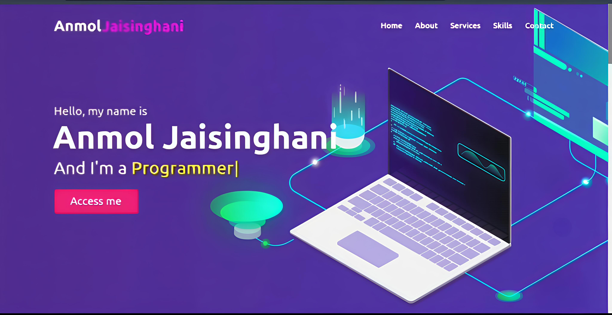

# 🎉 My Portfolio Website



Welcome to my personal portfolio website! 🌟  
This project showcases my skills and projects in web development, built using standard web technologies. Whether you're a potential employer, collaborator, or fellow developer, I hope you find this portfolio informative and inspiring.

---

## 📋 Table of Contents

- [About](#about)
- [Features](#features)
- [Technologies Used](#technologies-used)
- [Getting Started](#getting-started)
- [Customization](#customization)
- [License](#license)
- [Contact](#contact)

---

## 🌟 About

This portfolio website serves as a central hub to display my work and provide information about my capabilities as a developer. It’s designed to be **clean, responsive**, and **easy to navigate**, offering a quick overview of my expertise to potential employers or collaborators.

---

## ✨ Features

- **Responsive Design:** Looks great on desktops, tablets, and mobile devices. 📱💻
- **Project Showcase:** Highlight key projects with descriptions, technologies used, and links to live demos or repositories.
- **Skills Section:** Clearly lists my technical skills and proficiencies.
- **About Me:** A brief introduction to my background and passion for development.
- **Contact Info:** Easy ways for visitors to connect with me.
- **Smooth Navigation:** Intuitive menu for quick access to different sections.

---

## 🛠️ Technologies Used

- **HTML5:** Structuring the website content.
- **CSS3:** Styling and layout, including responsiveness.
- **JavaScript (ES6+):** Interactive features and dynamic content.

---

## 🚀 Getting Started

Follow these simple steps to run the website locally:

### Prerequisites

All you need is a web browser. For development, a code editor like VS Code is recommended.

### Installation

1. **Clone the repository:**

```bash
git clone https://github.com/anmoljaisinghani/My-Portfolios.git
```

2. **Navigate to the project directory:**

```bash
cd HTML_CSS_JS Portfolios
```

3. **Open `index.html`:**  
Simply open the `index.html` file in your preferred web browser to view the website locally.

### Live Demo

You can also view a live version here: [View Live Portfolio](https://portfolio1-htmlcssjs.netlify.app/)

---

## 🎨 Customization

Feel free to fork this repository and tailor it to your own needs! To do so:

- **Update Content:** Replace all text, images, and project details within the HTML files.
- **Adjust Styling:** Customize the CSS to match your personal branding.
- **Enhance Functionality:** Modify or add JavaScript features as needed.

---

## ⚖️ License

This project is **open source** under the **MIT License**.  
*(Please add a `LICENSE` file in your repository to specify license details.)*

---

## 📫 Contact

Interested in collaborating or have questions? Reach out!

- **Email:** [anmoljaisinghani7@gmail.com](mailto:anmoljaisinghani7@gmail.com)
- **GitHub:** [My GitHub Profile](https://github.com/anmoljaisinghani)

---

Thank you for visiting my portfolio! 😊  
Feel free to explore, fork, and customize! 🚀✨
